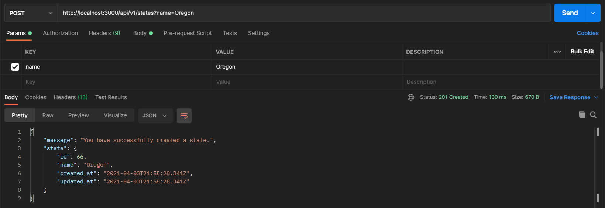
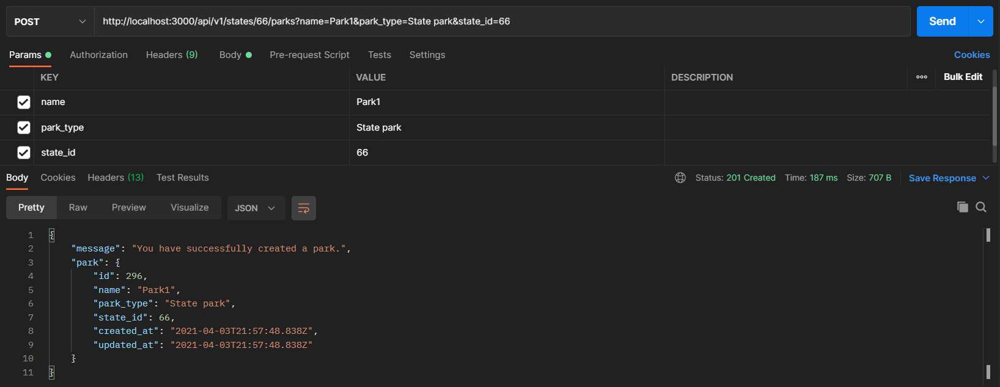

# Park Lookup API

### Authored by: Mekinsie Callahan

## Description
The objective of this project is to create a Rails API using RESTful principles, exploring the following topics:
* Building an API that includes full CRUD functionality and nested routes
* Successfully returning JSON objects via Postman and cURL
* Returning headers with the correct HTTP status code
* Testing APIs with rspec request specs
* Documenting your API endpoints
* Handling exceptions when an API call fails
* CORS is enabled

## Technologies used

* HTML
* Bootstrap
* CSS
* git
* Ruby on Rails
* Embedded Ruby (ERB)
* RSpec
* Bundler
* PostgreSQL
* Faker
* FactoryBot

* * *
## Authentication
This services does not require any authentication. CORS is also enabled.
* * *
## Software Requirements
* **Ruby is required to run this application**
* **PostgreSQL is required to run the database**  

 <a href="https://www.learnhowtoprogram.com/ruby-and-rails/getting-started-with-ruby/installing-ruby">Ruby download instructions</a>  
  <a href="https://www.learnhowtoprogram.com/ruby-and-rails/getting-started-with-ruby/installing-postgres">PosgreSQL download instructions</a>  

## Installation Instructions
1. Navigate to the desired directory where you would like to clone the project to.

2. Once you have chosen your desired directory, clone the github repo using the version control tool `git` (<a href="https://www.learnhowtoprogram.com/introduction-to-programming/getting-started-with-intro-to-programming/git-and-github">download instructions</a>). Typing the following command into your terminal:
```bash
$ git clone https://github.com/mekinsie/gathered_analysis
```
3. Open the project in VSCode by typing the following in your terminal:

``` bash
$ code .
```
* Note: VSCode is a code editing software. If you don't already have it, you can download it <a href="https://code.visualstudio.com/">here</a>

4. While located in the root directy, install gem bundler by typing:

``` bash
$ gem install bundler
```

5. Install gem bundles by typing:

``` bash
$ bundle install
```

6. Create a database and seed it with the following command:
```
$ rake db:setup
```
The database should now be correctly set up. And you may start a local server to interact with the project. 

7. To start a local server, type the following into your terminal:
```
$ rails s
```
Now that the server is running, you may make successfully make API calls.
* * *
## How To Make an API Call
Open an API client such as <a href="https://www.postman.com/downloads/" alt="Link to Postman download">Postman</a>  

_Note:_  
_* All API calls must have the base URL: http://localhost:3000/api/v1/_  
_* All routes for park requests must have the correct corresponding state id._  
_* In order to **post** a new state or park, you must input **all** of their params._  
_* In order to **update** a state or park, you can choose to pass in only the param you want to change._

**Params**
* The params for a state is: _name_  
* The params for a park is: _name, park_type ("State park" or "National park"), and state_id_  
  

**Example POST request for states:**



**Example POST request for parks:**


 Action |  Route | Description
| :--- | --- | ---: |
| Get | /states | _Fetches all states_ |
| Post | /states | _Creates a state_ |
| Delete | /states/{state_id} | _Deletes a state_ |
| Get | /states/{state_id} | _Fetches a single state_ |
| Patch | /states/{state_id} | _Updates a single state_ |
| Get | /states/{state_id}/parks | _Fetches all parks for a state_ |
| Post | /states/{state_id}/parks | _Creates a park for a state_     |
| Delete | /states/{state_id}/parks/{park_id} | _Deletes a park for a state_ |
| Get | /states/{state_id}/parks/{park_id} | _Fetches a single park for a state_ |
| Patch | /states/{state_id}/parks/{park_id} | _Updates a single park for a state_ |  
* * *
## Responses & Errors
404 - Not Found  
  **{ "message": "Couldn't find State/Park with 'id'=  "" }**  
422 - Unprocessable Entity  
  **{ "message": "Validation failed" }**  
500 - Internal Server Error  
  **{ "error": "Internal Server Error" }**
* * *
## Running Tests
* This application was created using test-driven development (TDD).
* To run the tests yourself, follow the steps below.

Simply type "rspec" into your terminal while located in the root directory of the project.
``` bash
$ rspec
```
* * *

## License
> [GPLv3](https://choosealicense.com/licenses/gpl-3.0/)\
> Mekinsie Callahan &copy; 2021  
* * *

## Contact Information

Reach Mekinsie via <a href="https://www.linkedin.com/in/mekinsie/" target="_blank">Linkedin</a> or <a href="mailto:mekinsie.aja@gmail.com" target="_blank">email</a></li>.